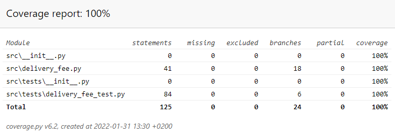
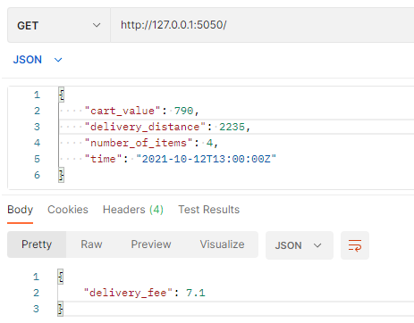
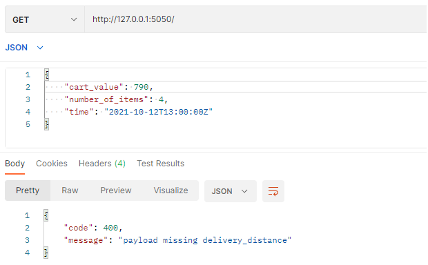

# wolt-assignment

This is my take on Wolt's assignment for engineering positions.

The application is a single endpoint to calculate the delivery fee based on the information in the request payload and responses with the calculated delivery fee in the response payload.

It's written in Python and uses Flask.
Python version "^3.9" is used.

---
## Getting started

This project uses [Poetry](https://python-poetry.org/) for packaging and managing dependencies.

### Install poetry
osx / linux / bashonwindows install instructions:
```
curl -sSL https://raw.githubusercontent.com/python-poetry/poetry/master/get-poetry.py | python -
```
windows powershell install instructions:
```
(Invoke-WebRequest -Uri https://raw.githubusercontent.com/python-poetry/poetry/master/get-poetry.py -UseBasicParsing).Content | python -
```
**Note:** if command "python" is not found, use "python3"  
**Note:** Sometimes installation of poetry requires reboot

After installation you need to add poetry to PATH. 

---
## Installation

To install dependencies using poetry, go to the root directory and use command
```
poetry install
```
If you don't want to install dev dependencies, like test-libraries, use 
```
poetry install --without dev
```

**Note:** I found Poetry acting weird with virtualenvironments on Windows. Sometimes it couldn't create or read its cache directory, so I had to make new one with command below and try install again
```powershell
$env:POETRY_CACHE_DIR="new/route/to/dir/"
```

---
## Run
After successfully installing dependencies, there's few ways to run application.

Easiest way is to set `FLASK_ENV` variable to point the app

```
export FLASK_APP=src.app
```
or on Windows
```
$env:FLASK_APP="src.app"
```

### Run application
After setting Flask env run application.
This application uses port 5000 as default port. 
```
poetry run flask run
```
or
```
poetry run flask run --port=80
```

### Run tests
```
poetry run pytest
```

### Run pylint
```
poetry run pylint src
```

### Run coverage for measuring code coverage
This creates html raport of the code coverage. It can be found from `.htmlcov/index.html` after running command
```
poetry run coverage run --branch -m pytest

poetry run coverage html
```  


---
### Usage
Here's couple images showcasing usage with Postman.

GET-request to localhost with example payload  


GET-request to localhost with example payload but missing delivery distance  


